<h1>CampusConnect</h1>

<h3>This project is derived from Online News Portal by Moni Kishore Dhar:</h3>
<h3>Project Purpose:</h3>
The purpose of the CampusConnect is to give campus students the opportunity to read and search up-to-date news on their campus, 
as well as to give authenticated users(students) the opportunity to comment on specific news.
 

<h3>Project Goals and Objectives:</h3>
<ul>
<li>To provide immediate storage and retrieval of data and information to get all kinds of instant
and important news for all students.</li>
<li>To provide a free text search function facility for all news seeker.</li>
<li>To provide a secure account management function for admin and students.</li>
<li>To allow authenticated students to comment on specific news.</li>
<li>To provide an efficient news management functions to the admin panel to publish news as well as delete and update news.</li>
</ul>

<h3>Project Description:</h3>
This is a database application system that is to be used by students to read and search news in anytime and anywhere. The system keeps the record of all the admin, authenticated viewer. 
This system also has the ability to keep track of the news as well as comment record. This project intends to computerize online news system in order to provide the instant and 
important news and also to provide searching facility due to the grown size of records of news. 
 

<h3>System Users:</h3>

<ul>
<li><b>Administrator:</b> Has full privilege on the system's functions including admin panel maintenance.</li>
<li><b>Admin Panel:</b> Has full privilege on the news and comments functions.</li>
<li><b>Authenticated Viewers:</b> Has privilege in own comments function.</li>
</ul>

<h3>Language:</h3>
<ul>
<li><b>Frontend Design:</b> HTML5, CSS, Boostrap4, JavaScript.</li>
<li><b>Scripting Language:</b> PHP.</li>
<li><b>Database:</b> MySQL.</li>
<li><b>Server:</b>XAMPP Apache.</li>
</ul>

<h3>Snippet of the CampusConnect App</h3>

<h4>Admin</h4>
<table>
  <thead>
    <tr>
      <th>Screenshot</th>
      <th>Description</th>
    </tr>
  </thead>
  <tbody>
    <tr>
      <td>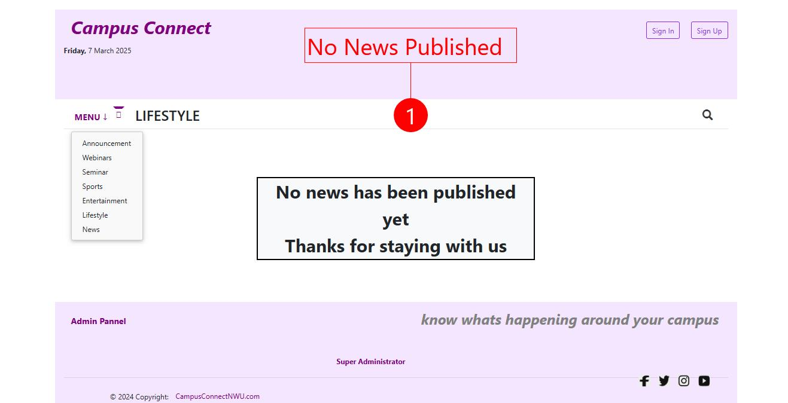</td>
      <td>No News Available screen.</td>
    </tr>
    <tr>
      <td>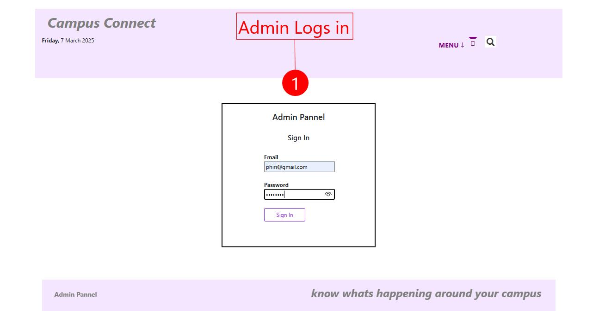</td>
      <td>Admin Login screen.</td>
    </tr>
    <tr>
      <td>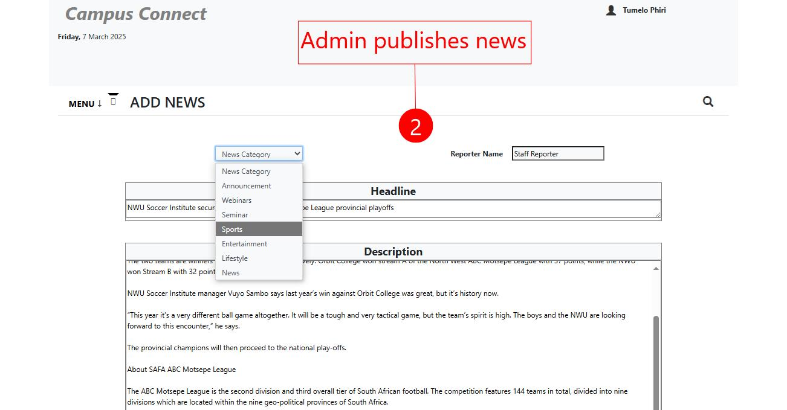</td>
      <td>Admin interface for adding news.</td>
    </tr>
    <tr>
      <td>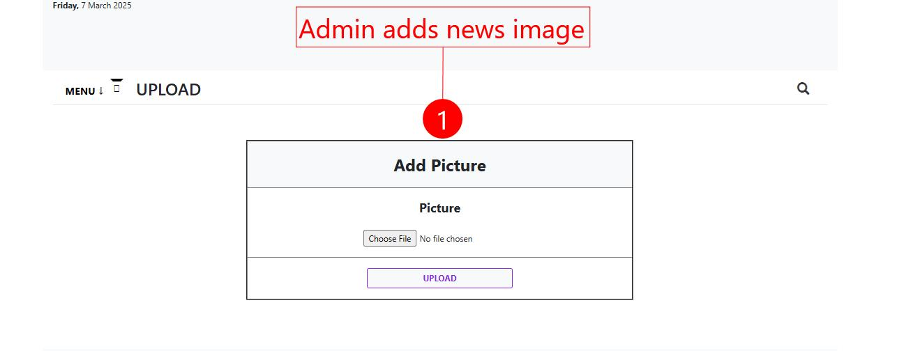</td>
      <td>Admin interface for adding an image to news.</td>
    </tr>
    <tr>
      <td></td>
      <td>News Published confirmation screen.</td>
    </tr>
  </tbody>
</table>

<h4>User</h4>
<table>
  <thead>
    <tr>
      <th>Screenshot</th>
      <th>Description</th>
    </tr>
  </thead>
  <tbody>
    <tr>
      <td>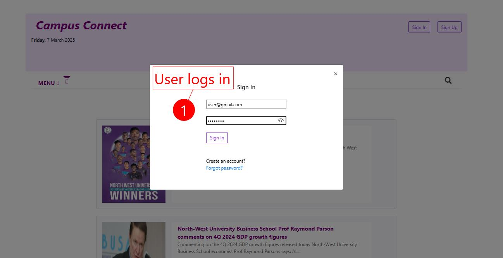</td>
      <td>User Login screen.</td>
    </tr>
    <tr>
      <td>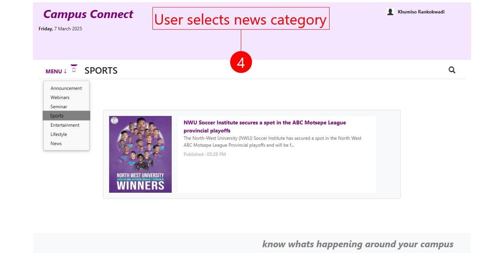</td>
      <td>User can select news category of their choice.</td>
    </tr>
    <tr>
      <td>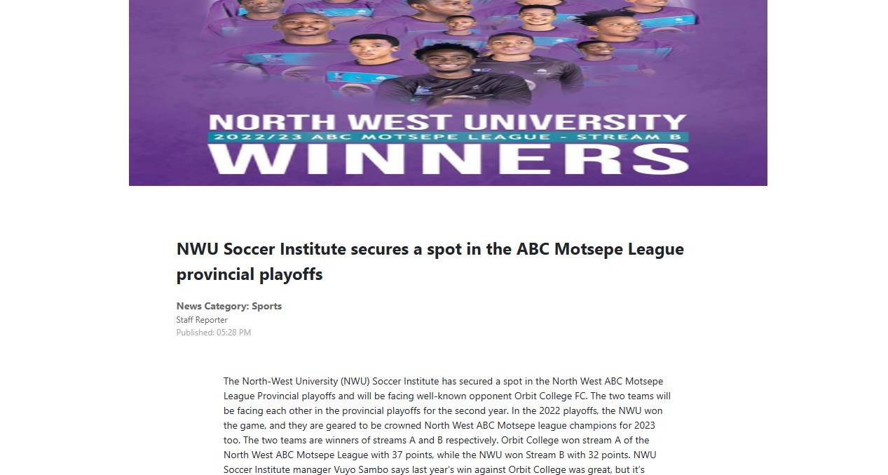</td>
      <td>News View screen.</td>
    </tr>
    <tr>
      <td></td>
      <td>User can add comments to news.</td>
    </tr>
    <tr>
      <td>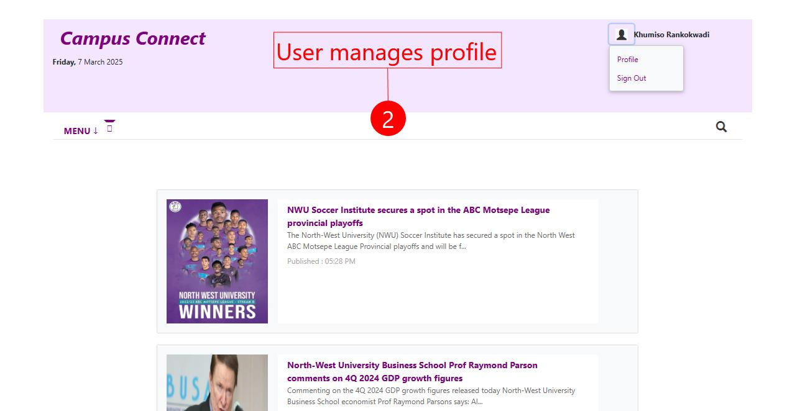</td>
      <td>User can sign out or their manage profile.</td>
    </tr>
    <tr>
      <td>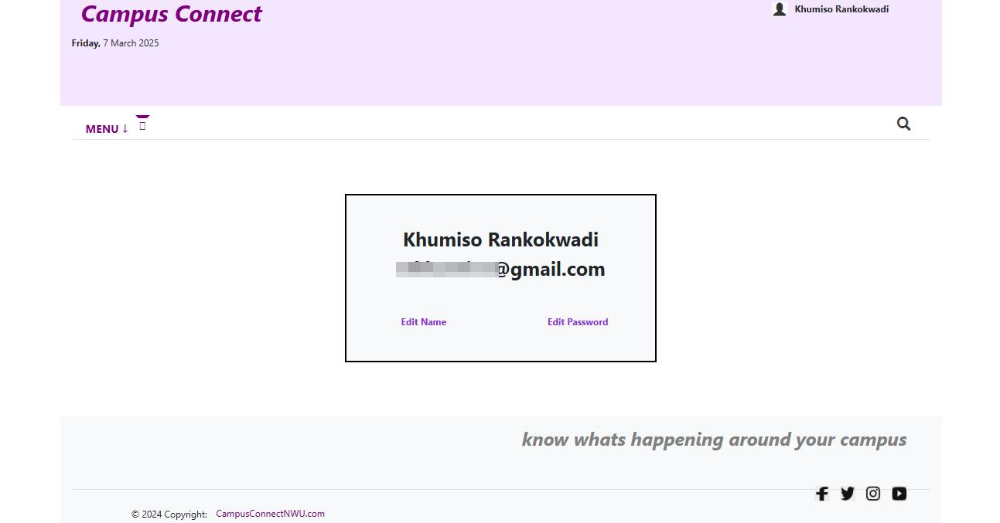</td>
      <td>User Profile screen.</td>
    </tr>
    <tr>
      <td>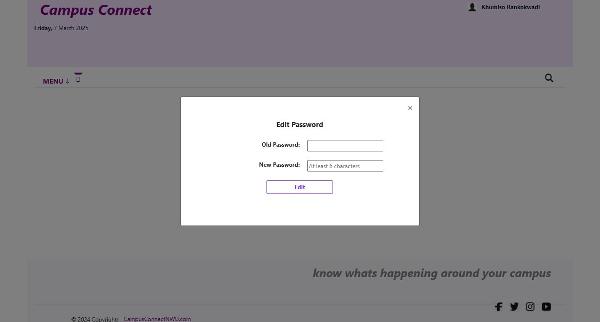</td>
      <td>User can edit their password.</td>
    </tr>
  </tbody>
</table>

<h4>Super Admin</h4>
<table>
  <thead>
    <tr>
      <th>Screenshot</th>
      <th>Description</th>
    </tr>
  </thead>
  <tbody>
    <tr>
      <td>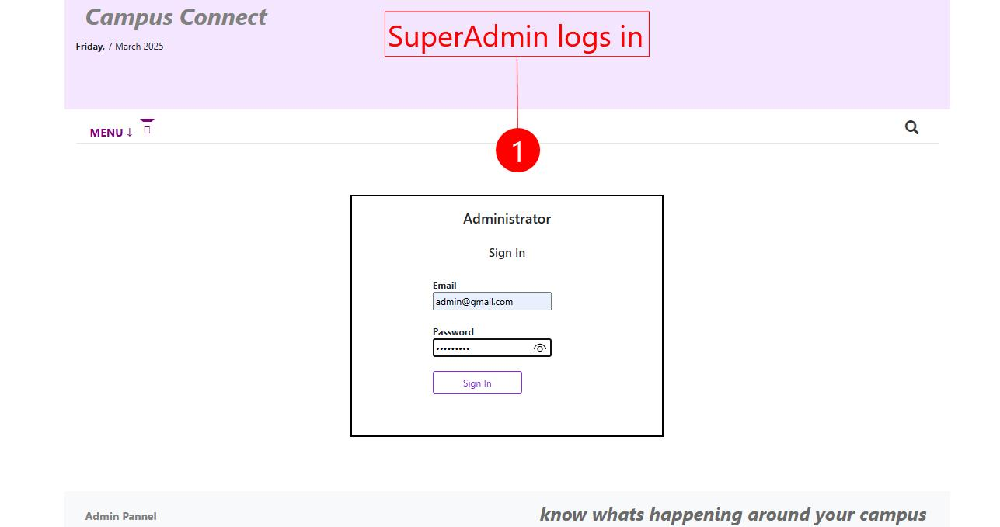</td>
      <td>Super Admin Login screen.</td>
    </tr>
        <tr>
      <td></td>
      <td>Super Admin and Admin interface allowing for editing news content.</td>
    </tr>
    <tr>
      <td>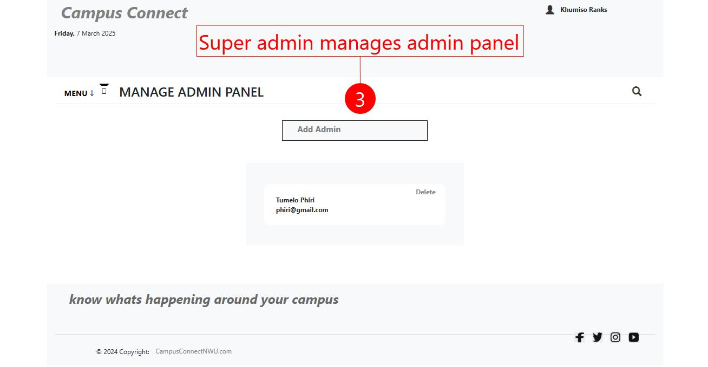</td>
      <td>Super Admin interface for managing admins.</td>
    </tr>
    <tr>
      <td>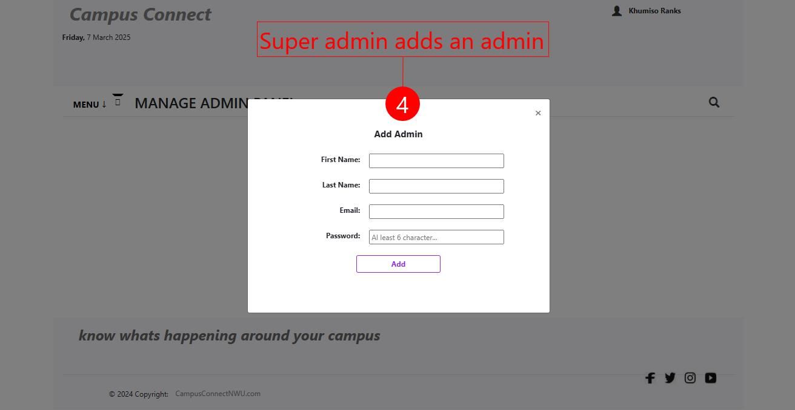</td>
      <td>Super Admin interface for adding new admins.</td>
    </tr>
  </tbody>
</table>

